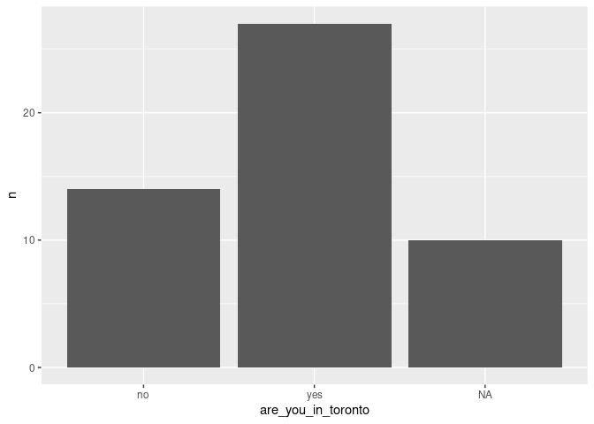

Session 2
================
Pacha
17/01/2022

# Read survey 1

Here we are going to read an Excel file:

``` r
survey1 <- readxl::read_excel("~/shared/survey1.xlsx") %>% 
  clean_names()
kable(survey1)
```

| are_you_in_toronto | nationality     | which_is_your_favourite_food | program                                           |
|:-------------------|:----------------|:-----------------------------|:--------------------------------------------------|
| Yes                | Chile           | Aji de gallina               | PhD Stats                                         |
| Yes                | Canada          | Sushi                        | Finance and Eco (Rotman) + Stats minor            |
| Yes                | China           | hongshaorou                  | Stats Specialist & Eco Major                      |
| No                 | Canada          | Shawarma                     | Statistics                                        |
| No                 | China           | Sushi                        | Actuarial and Statistical Sciences                |
| NA                 | NA              | NA                           | Stats & Eco                                       |
| No                 | China           | sushi                        | Finance and Eco (Rotman) + Stats minor            |
| No                 | China           | nanren                       | Rotman                                            |
| Yes                | Canada          | Pizza                        | Actuarial Science and Stats                       |
| NA                 | NA              | NA                           | NA                                                |
| Yes                | Canada          | Ramen                        | CCIT & Stats Minor                                |
| Yes                | Nigeria         | Mac and Cheese               | Economics and Statistics                          |
| Yes                | China           | Steak                        | statistics major kinesiology specialist           |
| NA                 | NA              | Steak                        | NA                                                |
| Yes                | China           | hotpot                       | CS & Stats                                        |
| Yes                | NA              | NA                           | NA                                                |
| No                 | China           | Ramen                        | Rotman Commerce Accounting Specialist Stats Minor |
| Yes                | Canada          | NA                           | NA                                                |
| Yes                | Canada          | Pasta                        | CS                                                |
| No                 | Jordan          | Sushi                        | Eco Data Analytics focus, Stats & Math minor      |
| Yes                | China           | Hotpot                       | Management Specialist (Rotman), Statistics Major  |
| Yes                | NA              | NA                           | NA                                                |
| Yes                | China           | Sushi                        | NA                                                |
| NA                 | NA              | NA                           | NA                                                |
| No                 | China           | Burger                       | Stats& Eco                                        |
| yes                | canada          | Sushi                        | Stats specialist (theory) and math major          |
| yes                | canada          | NA                           | NA                                                |
| No                 | China           | Ramen                        | math app in eco spe                               |
| Yes                | Canada          | Bagel                        | Computer Science and Stats                        |
| NA                 | NA              | NA                           | NA                                                |
| No                 | Canada          | Pizza                        | Economics and Statistics                          |
| Yes                | Filipino        | Lamb                         | MAT&STA                                           |
| No                 | Canada          | Pasta                        | Biology                                           |
| NA                 | NA              | NA                           | NA                                                |
| Yes                | Canada          | NA                           | Comp Sci + Stats                                  |
| Yes                | Mars            | Alien Meat                   | Alien studies                                     |
| no                 | UAE             | nandos                       | Econ, stats, math                                 |
| No                 | Canda           | Potatoes                     | Stats Specialist, theory                          |
| Yes                | China           | BBQ                          | Applied math in stat and Eco                      |
| No                 | China           | Hotpot                       | Economics & Statistics                            |
| Yes                | Mauritius       | BBQ                          | ActSci & Stats                                    |
| Yes                | Kazakhstan      | KBBQ                         | Stats & GIS                                       |
| NA                 | NA              | NA                           | NA                                                |
| No                 | China           | Chicken                      | MAT&STA                                           |
| NA                 | NA              | NA                           | NA                                                |
| Yes                | Turkish         | Dumplings                    | Rotman                                            |
| Yes                | Indian/Canadian | Everything                   | Cognitive Science, Computer Science, Math(minor)  |
| Yes                | China           | Hotpot                       | Mathmatics and its application(prob&sta           |
| NA                 | NA              | NA                           | NA                                                |
| NA                 | NA              | NA                           | NA                                                |
| Yes                | China           | hotpot                       | Economis and Mathematics                          |

Add a plot

``` r
survey1 %>% 
  mutate(are_you_in_toronto = tolower(are_you_in_toronto)) %>% 
  group_by(are_you_in_toronto) %>% 
  count() %>% 
  ggplot() +
  geom_col(aes(x = are_you_in_toronto, y = n))
```

<!-- -->
